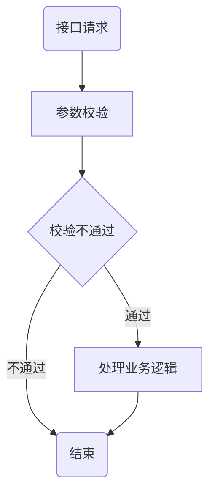

# 第一个
但是
> d
>> c
>>> dssds
## 二
__da__ da _da_ ___da___
```java
cout<<a<<"asdasd"<<endl;
printf("dsd")
```
- da
- c
- ds
  1. ds
  2. ds
  3. cx


```sequence
李雷 -> 韩梅梅: Hello 梅梅, How are you?
Note right of 韩梅梅: 韩梅梅心想
韩梅梅 --> 李雷: I'm fine, thanks, and you?da
```
[baidu](https://baidu.com)
点击|评论|举报
:--:|---:|:--
1|2|3
3|2|1

ada