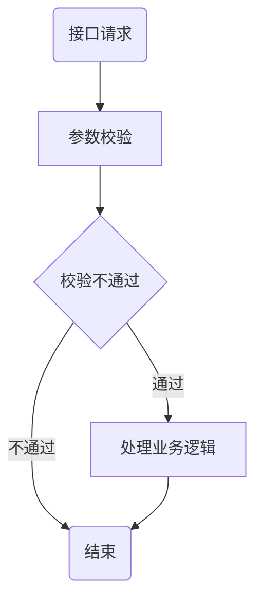

# 第一个
但是
> d
>> c
>>> dssds
## 二
__da__ da _da_ ___da___
```java
cout<<a<<"asdasd"<<endl;
printf("dsd")
```
- da
- c
- ds
  1. ds
  2. ds
  3. cx
  4. 
```sequence
对象A->对象B: 对象B你好吗?（请求）
Note right of 对象B: 对象B的描述
Note left of 对象A: 对象A的描述(提示)
对象B-->对象A: 我很好(响应)
对象A->对象B: 你真的好吗？
```
```sequence
    网友 -> X宝 : 网购钟意的商品
    X宝 --> 网友 : 下单成功
    

```

```sequence
李雷 -> 韩梅梅: Hello 梅梅, How are you?
Note right of 韩梅梅: 韩梅梅心想
韩梅梅 --> 李雷: I'm fine, thanks, and you?da
```
[baidu](https://baidu.com)
点击|评论|举报
:--:|---:|:--
1|2|3
3|2|1

ada