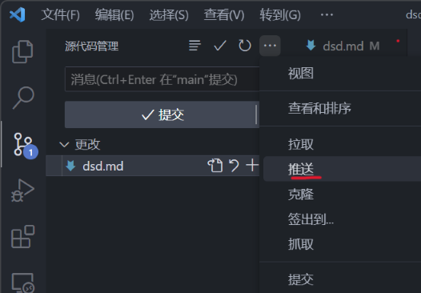

# 第一次使用vscode的git功能学习并记录

### 第一步 下载安装
安装vscode以及git
### 第二步 配置名字、邮箱
打开gitbash，配置你的全局名称以及邮箱(共同开发同一个项目时，方便找老六)
> git config --global user.name "GitHub名字"  
> git config --global user.email "GitHub邮箱"

这里也可以为每一个项目进行不同的设置，去掉--global即可
> git config user.name "名字"

### 第三步 创建公钥
在GitBash中输入
> ssh-keygen

建议**连按三次回车**(跳过更改文件路径和设置密码步骤)，然后去默认的路径 复制公钥
> C:/Users/用户名/.ssh/ id_rsa.pub

用记事本打开这个文件，并复制全部内容，再打开github，在设置中选择**SSH and GPG keys**，点击**new ssh key**，为你密钥起个名字，将粘贴板的内容粘贴到下面**key**的文本框中，最后点击最下面**add ssh key**按钮即可

### 第四步 创建github仓库
在首页点击**头像** -> Your respositories -> new, 在Repository name处填写仓库名称，并勾选 
- [x]  Add a README file    

然后点击**creat respositories**按钮，创建完成，__最后复制仓库的URL__

### 第五步 链接
在文件资源管理器中打开你想下载仓库的文件夹，鼠标右键选择 Open Git Bash Here (没有的话[点击这里学习设置](https://www.cnblogs.com/mythdoraemon/p/9865567.html))
> git clone URL //URL为你仓库的URL

打开克隆过来的文件夹就可以了

#### 第五步也可以在vscode中完成
打开vscode按下
> ctrl+shift+G

打开源代码管理器，点击**克隆仓库**，在弹出窗口中粘贴你仓库的URL，输入回车，然后选择将仓库中的文件保存什么地方，最后在弹出窗口中选择打开仓库就完成了

#### 如果克隆时出现错误(Failed to connect to http://github.com port 443)
多半由于访问不到GitHub，需要配置一下魔法端口
> git config --global http.proxy 127.0.0.1:xxxx#根据自己的代理插件设置全局端口

### 第六步 提交代码到仓库
修改完代码或文件后  
  
点击红圈位置  
  
点击修改文件右侧的加号(**1**)即可将文件送入暂存区，对应
> git add dsd

点击更改右侧加号(**2**)可将全部更改文件送入暂存区，对应
> git add .

放置好后，在(**3**)处填写这次提交的信息(**必须填写**),对应
> git commit -m "信息"

再点击(**4**)处的三个点  
  
点击**推送**，对应
> git push origin master

完成上传(**如果总是失败注意端口设置**)，可以在github上查看

(截稿日期2023.7.9)
